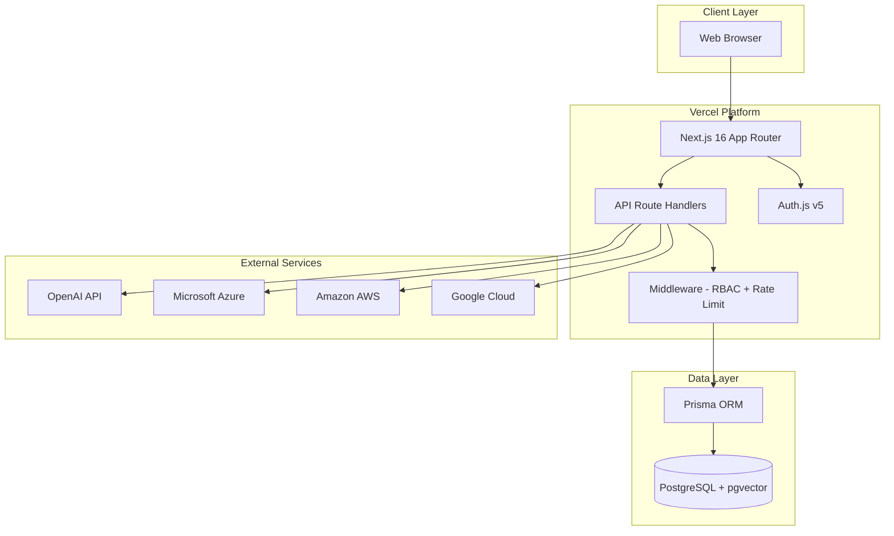
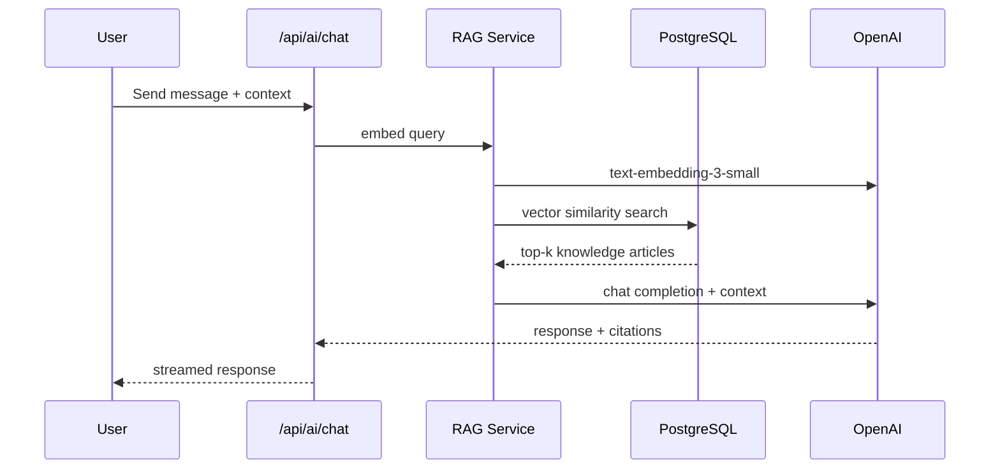

# AIOps Center — System Architecture

## Overview

AIOps Center is a multi-tenant SaaS platform for IT operations teams. It combines infrastructure monitoring, alert management, automation, knowledge management, and AI-assisted remediation in a single Next.js application deployed on Vercel with PostgreSQL (pgvector) as the primary datastore.

## Architecture Diagram

## Component Layers

| Layer | Technology | Responsibility |
|-------|-----------|----------------|
| Presentation | Next.js RSC + Client Components, shadcn/ui, Tailwind | Dashboard, forms, charts, dark mode |
| API | Next.js Route Handlers | REST endpoints, validation, RBAC enforcement |
| Auth | Auth.js v5 + Prisma Adapter | Sessions, credentials, MFA, role claims |
| Business Logic | `src/lib/services/*` | Alert engine, automation runner, RAG pipeline |
| Data | Prisma + PostgreSQL | Normalized relational data, vector embeddings |
| Security | Middleware, audit logs, rate limiter | RBAC, MFA, encryption, API throttling |

## Multi-Tenancy

All tenant-scoped resources include `organizationId`. API handlers resolve the active organization from the authenticated session. Cross-tenant access is prevented at the query level.

## RBAC Matrix

| Resource | Administrator | Engineer | Technician | Read-Only |
|----------|:---:|:---:|:---:|:---:|
| Dashboard | RW | RW | R | R |
| Assets | CRUD | CRUD | CRU | R |
| Alerts | CRUD | CRUD | CRU | R |
| Automations | CRUD + Execute | CRUD + Execute | Execute | R |
| Knowledge Base | CRUD | CRU | R | R |
| Cloud Resources | CRUD | R | R | R |
| Reports | Generate | Generate | Generate | R |
| Users/Settings | CRUD | R | R | R |
| Audit Logs | R | R | - | - |

## AI / RAG Pipeline

## Alert Engine

1. **Ingestion** — API webhook, scheduled poll, or manual creation
2. **Correlation** — Match by `correlationId` or asset + severity window
3. **Suppression** — Honor `suppressedUntil` timestamps
4. **Escalation** — Policy-driven step execution
5. **History** — Immutable audit trail in `alert_history`

## Deployment Topology

- **Production**: Vercel (serverless functions) + Neon/Vercel Postgres
- **Local**: Docker Compose (app + PostgreSQL with pgvector)
- **CI/CD**: GitHub Actions (lint, test, build, deploy preview)

## Security Controls

- TLS in transit (Vercel enforced)
- AES-256-GCM encryption at rest for sensitive fields
- MFA via TOTP (optional per user)
- Session JWT with httpOnly cookies
- API rate limiting (100 req/min default)
- Comprehensive audit logging
